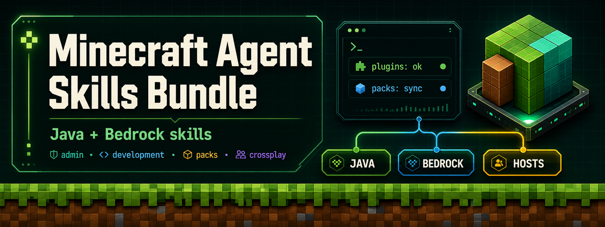
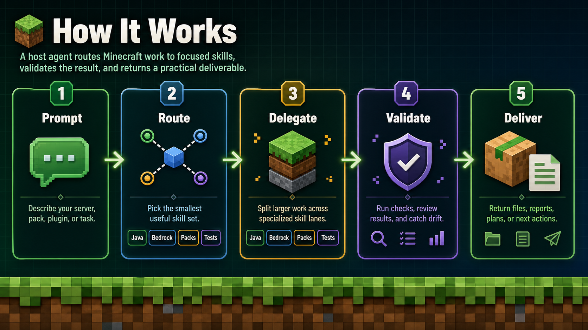

# Minecraft Agent Skills Bundle

[](https://github.com/AIKUSAN/minecraft-agent-skills-bundle/actions/workflows/skills-audit.yml)
[](LICENSE)
[](https://github.com/AIKUSAN/minecraft-agent-skills-bundle/releases/latest)
[](https://www.minecraft.net/)



An original, owner-managed bundle of **Minecraft agent skills** for Codex,
Claude Code, and plugin-based agent workflows. The bundle helps an AI agent route
Minecraft tasks across Java server administration, Bedrock operations, plugin and
mod development, datapacks, resource packs, crossplay, testing, release work, and
generated asset planning.

This repository is a standalone project and **not a fork** of another Minecraft
skills repo. The public repository name is `minecraft-agent-skills-bundle`; the
plugin/package identifier remains `minecraft-codex-skills` for install
compatibility.

This is an independent community project. It is not affiliated with, endorsed by,
sponsored by, or approved by Mojang Studios, Microsoft, or the official Minecraft
project.

## Quick Start

```bash
git clone https://github.com/AIKUSAN/minecraft-agent-skills-bundle.git
cd minecraft-agent-skills-bundle
```

| Install target | Use this path | Best for |
|---|---|---|
| Codex raw skills | `.agents/skills/` or `.codex/skills/` | Project-local skill routing |
| Codex plugin | `plugins/minecraft-codex-skills/` | Local marketplace installs through `/plugins` |
| Claude Code raw skills | `.claude/skills/` | Direct skill folder installs |
| Claude Code plugin | `plugins/minecraft-codex-skills/` | `claude --plugin-dir` testing |

Codex local marketplace installs expect the full repository layout so
`.agents/plugins/marketplace.json` and `plugins/minecraft-codex-skills/` stay
under the same repo root.

## Install Modes

### Codex raw skills

Copy the canonical `.agents` tree into a project:

```bash
cp -R .agents /path/to/your/project/
```

Codex can read `.agents/skills/` directly. The `.codex/skills/` mirror is kept
byte-for-byte aligned for hosts that prefer that layout.

### Codex local plugin

1. Open this repository in Codex.
2. Open `/plugins`.
3. Install `minecraft-codex-skills` from the local marketplace entry.
4. Reinstall or restart Codex if local plugin edits do not appear immediately.

### Claude Code raw skills

Copy the Claude mirror into a Claude Code project:

```bash
cp -R .claude /path/to/your/project/
```

### Claude Code plugin

Run Claude Code against the bundled plugin directory:

```bash
claude --plugin-dir ./plugins/minecraft-codex-skills
```

## Skill Routing

The bundle is designed so the host agent can inspect a user prompt, select the
smallest useful skill set, and split larger tasks across focused skill surfaces.
True sub-agent spawning depends on the host runtime, but the skill descriptions
and routing docs are written to support delegation when the runtime provides it.



| Work area | Skills to route |
|---|---|
| Java server administration | `minecraft-server-admin`, `minecraft-permissions-admin`, `minecraft-essentials-ops`, `minecraft-worldedit-ops` |
| Bedrock operations | `minecraft-bedrock-server-admin`, `minecraft-crossplay-ops` |
| Server and mod development | `minecraft-plugin-dev`, `minecraft-modding`, `minecraft-multiloader`, `minecraft-bedrock-addon-dev` |
| Vanilla and content systems | `minecraft-datapack`, `minecraft-commands-scripting`, `minecraft-world-generation` |
| Resource packs and conversion | `minecraft-resource-pack`, `minecraft-resource-pack-conversion`, `minecraft-imagegen` |
| Quality and release | `minecraft-testing`, `minecraft-ci-release` |

## Skills Catalog

| Skill | Purpose |
|---|---|
| `minecraft-server-admin` | Java server and plugin orchestration for Paper, Purpur, Folia, Velocity, marketplace sourcing, server-folder analysis, tuning, backups, and incidents |
| `minecraft-bedrock-server-admin` | Bedrock Dedicated Server setup, `server.properties`, allowlists, permissions, packs, worlds, backups, containers, and incident response |
| `minecraft-permissions-admin` | LuckPerms users, groups, tracks, contexts, temporary grants, Vault boundaries, audits, exports, and rollback |
| `minecraft-crossplay-ops` | Geyser and Floodgate operations for Bedrock clients joining Java infrastructure |
| `minecraft-essentials-ops` | EssentialsX kits, homes, warps, economy, moderation, permissions, and rollout checks |
| `minecraft-worldedit-ops` | WorldEdit selections, masks, schematics, brushes, safe rollback, and staff workflows |
| `minecraft-plugin-dev` | Paper/Bukkit plugin development with commands, events, schedulers, PDC, Adventure, Vault, and Paper APIs |
| `minecraft-modding` | NeoForge and Fabric mod development for blocks, items, entities, events, data generation, and runtime patterns |
| `minecraft-multiloader` | Architectury-style multiloader projects targeting NeoForge and Fabric from one codebase |
| `minecraft-bedrock-addon-dev` | Bedrock resource packs, behavior packs, manifests, Script API work, packaging, and BDS deployment |
| `minecraft-datapack` | Vanilla datapacks, functions, advancements, recipes, loot tables, predicates, and tags |
| `minecraft-commands-scripting` | Command systems, scoreboards, selectors, NBT paths, JSON text, and RCON-oriented scripting |
| `minecraft-world-generation` | Custom biomes, dimensions, configured features, structures, and worldgen validation |
| `minecraft-resource-pack` | Java resource packs, textures, models, sounds, animations, OptiFine-style assets, and shader-aware notes |
| `minecraft-resource-pack-conversion` | Java-to-Bedrock resource-pack conversion with `.mcpack` output and unsupported asset reports |
| `minecraft-imagegen` | Pack icons, server banners, promo images, concept textures, thumbnails, and visual briefs |
| `minecraft-testing` | JUnit 5, MockBukkit, GameTests, fixtures, CI checks, and regression test planning |
| `minecraft-ci-release` | GitHub Actions, Modrinth and CurseForge publishing, release notes, versioning, and artifact checks |

## Example Prompts

```bash
codex "Generate a docker-compose.yml for a Paper 1.21.11 server with Aikar JVM flags, persistent volumes, backups, and auto-restart."
```

```bash
codex "Analyze this Paper server folder, identify installed plugins, flag missing dependencies, and recommend a survival SMP plugin stack."
```

```bash
codex "Convert this Java resource pack into a Bedrock .mcpack, then report custom models or OptiFine-only assets that need manual review."
```

```bash
codex "Create a Bedrock behavior pack with a Script API welcome message, matching manifests, and deployment notes for Bedrock Dedicated Server."
```

```bash
codex "Build a Paper plugin that gives players a temporary speed boost when they eat a golden apple, with a cooldown stored in PDC."
```

## Repository Layout

```text
.agents/skills/                         canonical skill source
.codex/skills/                          Codex compatibility mirror
.claude/skills/                         Claude Code compatibility mirror
plugins/minecraft-codex-skills/skills/  plugin mirror
docs/assets/                            original README and branding assets
scripts/                                sync, audit, validation, and fixture helpers
tests/fixtures/                         validator fixtures
```

Edit canonical skill content in `.agents/skills/`, then sync mirrors:

```bash
bash ./scripts/sync-skills-layout.sh sync
```

## Development Checks

Repo development tooling requires Node 20+, `bash`, `jq`, and `rsync`.

```bash
npm ci
bash ./scripts/sync-skills-layout.sh check
npm run check
```

Targeted checks are also available:

```bash
npm run audit:skills
npm run test:docs
npm run test:validators
npm run check:plugin-bundle
npm run lint:md
```

## Supported Versions

|Platform|Version|Java|
|---|---|---|
|NeoForge|1.21.x examples centered on 21.11.x|21|
|Fabric|1.21.11 line (`fabric-api:0.116.10+1.21.1`)|21|
|Paper/Bukkit|1.21.x (`paper-api:1.21.11-R0.1-SNAPSHOT`)|21|
|Bedrock Dedicated Server|1.21.x|—|
|Bedrock add-ons / Script API|1.21.x|—|
|Vanilla datapack|1.21–1.21.11 (formats 48–94.1; `min_format` / `max_format` from 1.21.9+)|—|
|Resource pack|1.21–1.21.11 (formats 34–75.0; `min_format` / `max_format` from 1.21.9+)|—|

## License

MIT. See [LICENSE](LICENSE).
